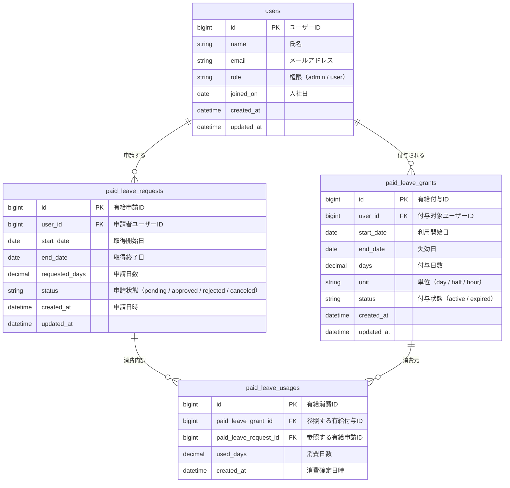

## ER図



## 環境構築
1. Dockerコンテナを起動
```
# （必要に応じて）既存のコンテナ・ボリュームを削除
docker compose -f docker/docker-compose.yml down -v

# イメージをビルド
docker compose -f docker/docker-compose.yml build --no-cache

# 依存関係をインストール（BE）
docker compose -f docker/docker-compose.yml run --rm app composer install

# 依存関係をインストール（FE）
docker compose -f docker/docker-compose.yml run --rm node npm install

# Laravelのアプリケーションキーを生成
docker compose -f docker/docker-compose.yml run --rm app php artisan key:generate

# DBマイグレーション
docker compose -f docker/docker-compose.yml run --rm app php artisan migrate

# コンテナを起動
docker compose -f docker/docker-compose.yml up -d
```

2. ローカル環境にアクセス

【FE】http://localhost:5173/

【BE】http://localhost:8000/


## その他コマンド
- 日々の操作系
```
# docker compose down
docker compose -f docker/docker-compose.yml down

# マイグレーションファイルを作成する
docker compose -f docker/docker-compose.yml run --rm app php artisan make:migration [ファイル名]

# マイグレーションを実行
docker compose -f docker/docker-compose.yml run --rm app php artisan migrate
```

- DB（PostgresSQL）関連
```
# Dockerから接続する
docker exec -it paid_leave_db psql -U app_user -d paid_leave

# ホストから接続する
psql -h 127.0.0.1 -p 55432 -U app_user -d paid_leave
```
